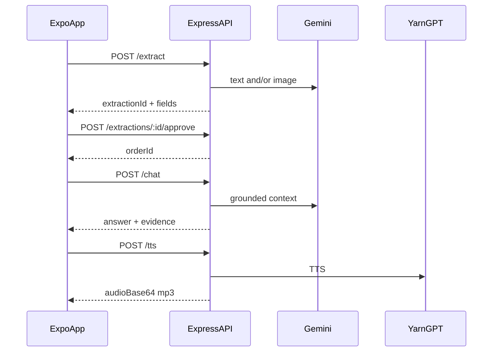

# FreBob API contract (mobile ? server)

Base URL (local): `http://localhost:4000/v1`

## Auth

| Mode | How |
|------|-----|
| Explore Demo | Header `X-Demo-Mode: 1` + demo business `00000000-0000-4000-8000-000000000001` (works with or without Supabase) |
| Memory (no Supabase) | Same demo header required for business routes |
| Real user (Supabase) | `Authorization: Bearer <access_token>`; user must be in `business_members` for that business |

### Client auth flow

1. Mobile signs up / signs in with Supabase Auth (email + password).
2. `POST /v1/auth/bootstrap` creates/updates `public.users` linked to `auth.users`.
3. If the user has no business yet, complete onboarding via `POST /v1/auth/businesses`.
4. Later API calls send the Bearer token and the user's `businessId`.

### Auth endpoints

| Method | Path | Auth | Purpose |
|--------|------|------|---------|
| GET | `/auth/me` | Bearer | Profile + businesses |
| POST | `/auth/bootstrap` | Bearer | Upsert `public.users` |
| POST | `/auth/businesses` | Bearer | Create business + owner membership (+ optional starter products) |

### Business update

`PATCH /businesses/:businessId` (demo header or Bearer + membership)

```json
{
  "name": "Amaka Provisions",
  "category": "Retail",
  "location": "Lagos",
  "phone": "+2348010000000",
  "currency": "NGN",
  "preferredLanguage": "en"
}
```

**Response** — `{ "business": { ... } }`

**POST `/auth/bootstrap` body (optional)**

```json
{ "name": "Amaka Okoye", "preferredLanguage": "en" }
```

**POST `/auth/businesses` body**

```json
{
  "name": "Amaka Provisions",
  "category": "Retail",
  "location": "Lagos",
  "phone": "+2348010000000",
  "currency": "NGN",
  "preferredLanguage": "en",
  "starterProducts": [{ "name": "Rice 50kg", "unitPrice": 45000, "available": 20 }],
  "inventoryNotes": "Opening notes"
}
```

All money/stock mutations happen **only after Approve**. Extracted fields are `unconfirmed` until then.



---

## `GET /health`

```json
{
  "ok": true,
  "service": "frebob-server",
  "store": "memory",
  "supabaseConfigured": false,
  "geminiConfigured": true,
  "yarnGptConfigured": true,
  "demoBusinessId": "00000000-0000-4000-8000-000000000001",
  "time": "?"
}
```

---

## `POST /extract`

**Request**

```json
{
  "businessId": "00000000-0000-4000-8000-000000000001",
  "source": "whatsapp",
  "sampleId": "sample_flagship",
  "text": "optional pasted chat",
  "imageBase64": "optional base64 or data-URL",
  "mimeType": "image/jpeg"
}
```

Uses **Gemini 2.0 Flash** (text + vision) when `GEMINI_API_KEY` is set; otherwise mock fixtures. Server always recomputes `total`, `balance`, `paymentStatus`.

**Response 201** ? `extractionId`, `status: "unconfirmed"`, `sourceText`, `fields`.

---

## `POST /extractions/:id/approve` / `reject`

Approve persists order, payment, inventory, memory. Reject marks extraction rejected with no stock change.

---

## `POST /businesses/:businessId/chat`

```json
{
  "question": "Who still owes me?",
  "language": "en",
  "speak": false
}
```

Grounded Gemini answer from approved records when key present; rule-based fallback otherwise.

**Response**

```json
{
  "text": "?",
  "evidence": "?",
  "intent": "gemini",
  "voice": null
}
```

If `speak: true`, `voice` is the same shape as `/tts`.

---

## `POST /tts` (YarnGPT)

```json
{
  "businessId": "00000000-0000-4000-8000-000000000001",
  "text": "Welcome to FreBob.",
  "language": "en",
  "voice": "Idera"
}
```

Calls [YarnGPT TTS](https://yarngpt.ai/api-docs) with `YARNGPT_API_KEY`.

| language | Behaviour |
|----------|-----------|
| `en`, `yo`, `ha`, `ig` | `{ supported: true, mimeType: "audio/mpeg", audioBase64, voice }` |
| `pcm` | `{ supported: false, reason: "Pidgin voice not validated?", audioBase64: null }` |

Missing key (non-pcm) ? **503**.

Default voices: en/yo ? `Idera`, ha ? `Umar`, ig ? `Chinenye`.

---

## Other business routes

- `GET /businesses/:id` ? profile  
- `GET|POST /businesses/:id/products`  
- `GET /businesses/:id/customers`  
- `GET /businesses/:id/orders`  
- `POST /businesses/:id/orders/:orderId/payments`  
- `POST /businesses/:id/orders/:orderId/cancel` ? releases reserved stock / restocks confirmed sales  
- `GET /businesses/:id/dashboard`  
- `GET /businesses/:id/memories`  
- `POST /demo/reset` ? memory mode only  

---

## Env

See [`server/.env.example`](../server/.env.example): `GEMINI_API_KEY`, `YARNGPT_API_KEY`, Supabase optional.

## Smoke

```bash
cd server
npm run dev   # other terminal
npm run smoke
```
